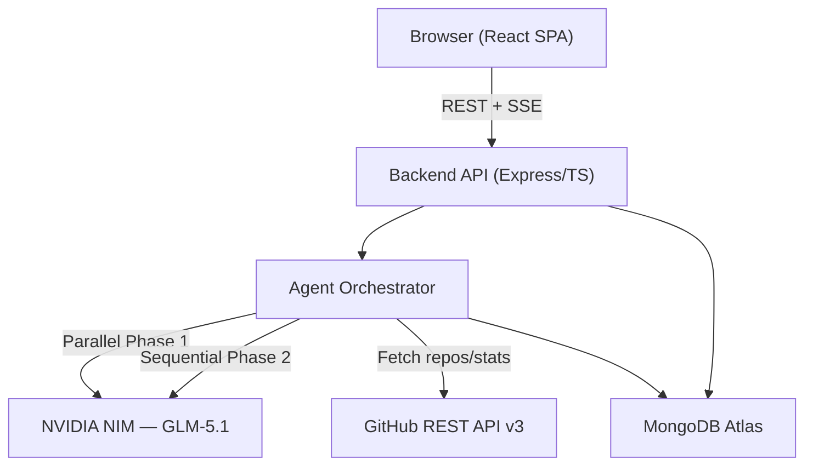
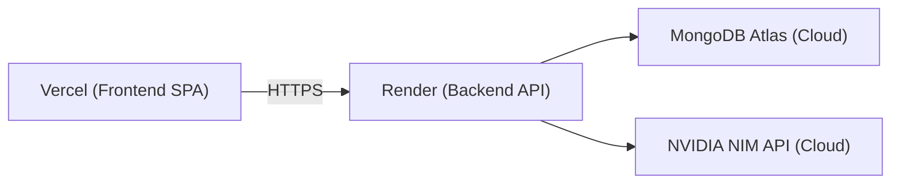
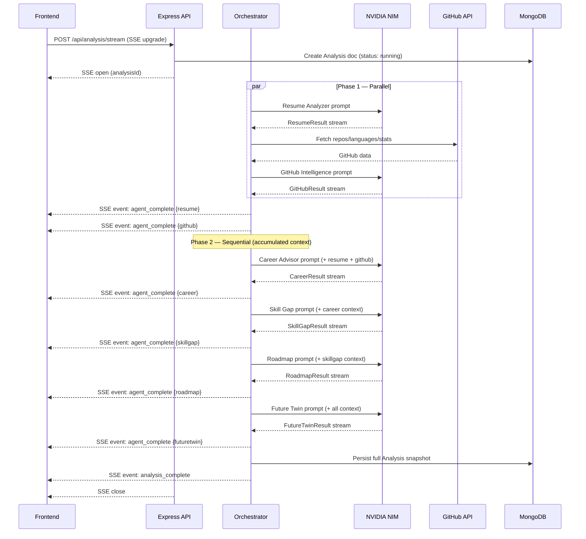
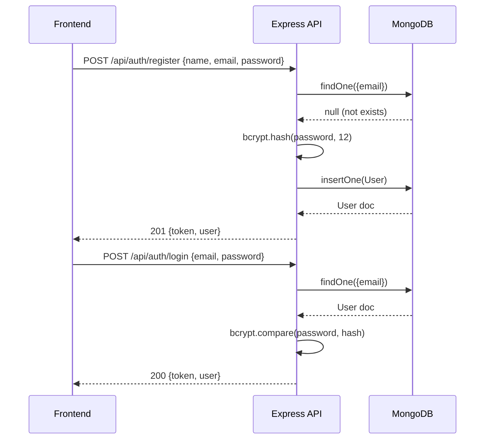

# Design Document: CareerTwin AI

## Overview

CareerTwin AI is an AI-powered digital career twin platform for software engineering students. Given a student's resume text, GitHub username, and career goals, the system fans out to six specialized LLM agents (powered by NVIDIA NIM / GLM-5.1) that analyze the student's current profile and project their future trajectory. Results stream in real-time over SSE and are rendered as an interactive bento-grid dashboard.

The platform is structured as a decoupled frontend (React + Vite + TypeScript + Tailwind + Framer Motion) and a backend orchestrator (Node.js + Express + TypeScript) persisting all structured results in MongoDB Atlas. Two-phase agent execution — parallel for data-intensive agents, sequential for context-accumulating agents — ensures both speed and coherence across the six output artifacts.

The key differentiator is the "Twin Orb" readiness score: a living animated gauge that composes signals from all six agents into a single 0–100 career readiness score, and projects it forward to a target role over a 3/6/12-month timeline.

---

## Architecture

### System Context



### Deployment Topology



---

## Sequence Diagrams

### Full Analysis Flow



### Authentication Flow



---

## Components and Interfaces

### Frontend Components

#### TwinOrb

**Purpose**: Animated SVG readiness score gauge; the central visual identity of the product.

**Interface**:
```typescript
interface TwinOrbProps {
  score: number          // 0–100 current readiness score
  projected?: number     // 0–100 projected score (optional overlay ring)
  size?: 'sm' | 'md' | 'lg'
  animateOnMount?: boolean
}
```

**Responsibilities**:
- Render two concentric SVG arcs (current vs projected)
- Use Framer Motion spring animation on score change
- Emit pulse glow via Tailwind ring utilities when analysis is running

#### ScoreRing

**Purpose**: Reusable circular progress indicator for individual agent scores.

**Interface**:
```typescript
interface ScoreRingProps {
  score: number          // 0–100
  label: string
  color?: string         // Tailwind color token
  size?: number          // px diameter, default 120
}
```

#### AgentPipeline

**Purpose**: Live status display for the 6-agent execution pipeline during SSE streaming.

**Interface**:
```typescript
type AgentStatus = 'pending' | 'running' | 'complete' | 'error'

interface AgentPipelineProps {
  agents: Array<{
    id: AgentId
    label: string
    status: AgentStatus
    durationMs?: number
  }>
}
```

#### BentoGrid

**Purpose**: CSS Grid wrapper for the dashboard widget layout.

**Interface**:
```typescript
interface BentoGridProps {
  children: React.ReactNode
  columns?: 1 | 2 | 3    // responsive column count
}
```

#### SkillRadar

**Purpose**: Radar chart overlaying current vs target skill coverage.

**Interface**:
```typescript
interface SkillRadarProps {
  current: Record<string, number>   // skill → 0–100
  target: Record<string, number>    // skill → 0–100
  labels: string[]
}
```

#### ProjectionTimeline

**Purpose**: Horizontal timeline showing 3/6/12-month projected milestones.

**Interface**:
```typescript
interface ProjectionTimelineProps {
  projections: Array<{
    months: 3 | 6 | 12
    role: string
    readiness: number
    keyMilestone: string
  }>
}
```

---

### Backend Modules

#### AuthModule

**Purpose**: JWT-based registration and login.

**Interface**:
```typescript
interface AuthModule {
  register(dto: RegisterDto): Promise<AuthResponse>
  login(dto: LoginDto): Promise<AuthResponse>
  verifyToken(token: string): JwtPayload
}
```

#### ProfileModule

**Purpose**: CRUD for user profile (resume, GitHub username, goals).

**Interface**:
```typescript
interface ProfileModule {
  upsertProfile(userId: string, dto: UpsertProfileDto): Promise<Profile>
  getProfile(userId: string): Promise<Profile>
}
```

#### AnalysisOrchestrator

**Purpose**: Coordinates the two-phase agent pipeline, emits SSE events.

**Interface**:
```typescript
interface AnalysisOrchestrator {
  runAnalysis(
    profile: Profile,
    sseEmitter: SSEEmitter
  ): Promise<AnalysisSnapshot>
}
```

#### LLMClient

**Purpose**: Wraps NVIDIA NIM OpenAI-compatible SDK with streaming support and output robustness.

**Interface**:
```typescript
interface LLMClient {
  chatStream(
    messages: ChatMessage[],
    schema: z.ZodSchema
  ): Promise<unknown>        // validated & parsed JSON
}
```

#### RoadmapModule

**Purpose**: Mutable progress tracking for the student's roadmap.

**Interface**:
```typescript
interface RoadmapModule {
  getLatest(userId: string): Promise<RoadmapDoc>
  updateProgress(userId: string, dto: ProgressUpdateDto): Promise<RoadmapDoc>
}
```

---

## Data Models

### User

```typescript
interface User {
  _id: ObjectId
  name: string
  email: string                // unique, lowercase
  passwordHash: string         // bcrypt 12 rounds
  createdAt: Date
  updatedAt: Date
}
```

**Validation Rules**:
- `email` must match RFC 5322, unique index
- `password` minimum 8 characters before hashing
- `name` 1–100 characters

### Profile

```typescript
interface Profile {
  _id: ObjectId
  userId: ObjectId             // ref: User, unique index
  resumeText: string           // raw paste, max 20 000 chars
  githubUsername: string       // GitHub login handle
  currentSkills: string[]      // self-reported skill list
  targetRole: string           // e.g. "Senior Frontend Engineer"
  dreamCompany: string         // e.g. "Stripe"
  experienceLevel: 'student' | 'junior' | 'mid' | 'senior'
  createdAt: Date
  updatedAt: Date
}
```

### Analysis (versioned snapshot)

```typescript
interface AnalysisSnapshot {
  _id: ObjectId
  userId: ObjectId
  version: number              // auto-increment per user
  status: 'running' | 'complete' | 'failed'
  startedAt: Date
  completedAt?: Date
  agents: {
    resume?: ResumeResult
    github?: GitHubResult
    career?: CareerResult
    skillGap?: SkillGapResult
    roadmap?: RoadmapResult
    futureTwin?: FutureTwinResult
  }
  errorMessage?: string
}
```

### Agent Result Schemas

```typescript
interface ResumeResult {
  atsScore: number             // 0–100
  missingKeywords: string[]
  improvements: string[]
  overallAssessment: string
}

interface GitHubResult {
  healthScore: number          // 0–100
  projectQualityScore: number  // 0–100
  repoInsights: string[]
  standoutRepo: string
  languageDistribution: Record<string, number>  // lang → % of bytes
  totalRepos: number
  totalStars: number
}

interface CareerResult {
  readinessScore: number       // 0–100 (primary Twin Orb value)
  recommendedPath: string
  strengths: string[]
  summary: string
}

interface SkillGapResult {
  coverageScore: number        // 0–100
  matchedSkills: string[]
  missingSkills: Array<{ skill: string; priority: 'high' | 'medium' | 'low' }>
}

interface RoadmapResult {
  plan30: WeeklyPlan[]
  plan90: WeeklyPlan[]
  projectRecommendations: string[]
  interviewPrep: string[]
}

interface WeeklyPlan {
  week: number
  goal: string
  tasks: string[]
  milestone: string
}

interface FutureTwinResult {
  readinessTimeline: string
  projectedRole: string
  projections: Array<{
    months: 3 | 6 | 12
    role: string
    readiness: number
    keyMilestone: string
  }>
  narrativeSummary: string
}
```

### Roadmap (mutable progress)

```typescript
interface RoadmapDoc {
  _id: ObjectId
  userId: ObjectId             // unique index
  analysisId: ObjectId         // links to source snapshot
  plan30: Array<WeeklyPlan & { completed: boolean }>
  plan90: Array<WeeklyPlan & { completed: boolean }>
  projectRecommendations: string[]
  interviewPrep: string[]
  progressPercent: number      // computed: completed tasks / total tasks
  updatedAt: Date
}
```

---

## Algorithmic Pseudocode

### Main Analysis Orchestrator

```typescript
async function runAnalysis(
  profile: Profile,
  sseEmitter: SSEEmitter
): Promise<AnalysisSnapshot>
```

**Preconditions**:
- `profile.resumeText` is non-empty string ≤ 20 000 chars
- `profile.githubUsername` is a valid GitHub handle
- `profile.targetRole` is non-empty
- `sseEmitter` is an open SSE connection

**Postconditions**:
- Returns `AnalysisSnapshot` with `status === 'complete'`
- All 6 agent result slots are populated
- SSE has emitted `agent_complete` for all 6 agents
- Snapshot is persisted to MongoDB

**Algorithm**:
```typescript
ALGORITHM runAnalysis(profile, sseEmitter):

  // Initialize snapshot
  snapshot ← createAnalysisDoc(profile.userId, status: 'running')
  sseEmitter.emit('analysis_start', { analysisId: snapshot._id })

  // ── Phase 1: Parallel ──────────────────────────────────────────
  githubRaw ← await fetchGitHubData(profile.githubUsername)

  [resumeResult, githubResult] ← await Promise.all([
    runAgent('resume', buildResumePrompt(profile), ResumeResultSchema),
    runAgent('github', buildGitHubPrompt(profile, githubRaw), GitHubResultSchema)
  ])

  snapshot.agents.resume ← resumeResult
  snapshot.agents.github ← githubResult
  sseEmitter.emit('agent_complete', { agent: 'resume', data: resumeResult })
  sseEmitter.emit('agent_complete', { agent: 'github', data: githubResult })

  // ── Phase 2: Sequential (accumulated context) ──────────────────
  ctx ← { profile, resumeResult, githubResult }

  careerResult ← await runAgent('career', buildCareerPrompt(ctx), CareerResultSchema)
  snapshot.agents.career ← careerResult
  ctx.careerResult ← careerResult
  sseEmitter.emit('agent_complete', { agent: 'career', data: careerResult })

  skillGapResult ← await runAgent('skillgap', buildSkillGapPrompt(ctx), SkillGapResultSchema)
  snapshot.agents.skillGap ← skillGapResult
  ctx.skillGapResult ← skillGapResult
  sseEmitter.emit('agent_complete', { agent: 'skillgap', data: skillGapResult })

  roadmapResult ← await runAgent('roadmap', buildRoadmapPrompt(ctx), RoadmapResultSchema)
  snapshot.agents.roadmap ← roadmapResult
  ctx.roadmapResult ← roadmapResult
  sseEmitter.emit('agent_complete', { agent: 'roadmap', data: roadmapResult })

  futureTwinResult ← await runAgent('futuretwin', buildFutureTwinPrompt(ctx), FutureTwinResultSchema)
  snapshot.agents.futureTwin ← futureTwinResult
  sseEmitter.emit('agent_complete', { agent: 'futuretwin', data: futureTwinResult })

  // Finalize
  snapshot.status ← 'complete'
  snapshot.completedAt ← now()
  await persistSnapshot(snapshot)
  await upsertRoadmapDoc(profile.userId, snapshot)

  sseEmitter.emit('analysis_complete', { analysisId: snapshot._id })
  sseEmitter.close()

  RETURN snapshot

  // Error handling
  ON_ERROR(err):
    snapshot.status ← 'failed'
    snapshot.errorMessage ← err.message
    await persistSnapshot(snapshot)
    sseEmitter.emit('analysis_error', { message: err.message })
    sseEmitter.close()
    THROW err
```

**Loop Invariants**: N/A (sequential await chain, no loops)

---

### LLM Output Robustness — Three-Layer Parser

```typescript
async function robustParse<T>(
  rawText: string,
  schema: z.ZodSchema<T>,
  repairFn: (raw: string, error: string) => Promise<string>
): Promise<T>
```

**Preconditions**:
- `rawText` is a non-empty string from LLM completion
- `schema` is a valid Zod schema
- `repairFn` is an async function that calls LLM again for self-repair

**Postconditions**:
- Returns `T` that satisfies `schema`
- Throws `ParseError` only after all three layers are exhausted

**Algorithm**:
```typescript
ALGORITHM robustParse(rawText, schema, repairFn):

  // Layer 1: Fence extraction
  jsonCandidate ← extractJsonFromFences(rawText)
    // Regex: /```(?:json)?\s*([\s\S]*?)```/
    // Fallback: first '{' to last '}' substring

  // Layer 2: Zod validation
  parseResult ← schema.safeParse(JSON.parse(jsonCandidate))
  IF parseResult.success THEN
    RETURN parseResult.data
  END IF

  // Layer 3: Self-repair retry (1 attempt)
  errorSummary ← formatZodErrors(parseResult.error)
  repairedText ← await repairFn(rawText, errorSummary)
  jsonRepaired ← extractJsonFromFences(repairedText)
  repairResult ← schema.safeParse(JSON.parse(jsonRepaired))
  IF repairResult.success THEN
    RETURN repairResult.data
  END IF

  THROW new ParseError('LLM output failed all 3 robustness layers', {
    original: rawText,
    repaired: repairedText,
    zodErrors: repairResult.error
  })
```

**Loop Invariants**: N/A (fixed 3-layer cascade, no loop)

---

### SSE Emitter

```typescript
function createSSEEmitter(res: Response): SSEEmitter
```

**Preconditions**:
- `res` is an Express Response with headers not yet sent

**Postconditions**:
- Response headers set to `Content-Type: text/event-stream`
- Returns emitter with `emit(event, data)` and `close()` methods

**Algorithm**:
```typescript
ALGORITHM createSSEEmitter(res):
  res.writeHead(200, {
    'Content-Type': 'text/event-stream',
    'Cache-Control': 'no-cache',
    'Connection': 'keep-alive',
    'X-Accel-Buffering': 'no'
  })
  res.flushHeaders()

  FUNCTION emit(event: string, data: unknown): void
    res.write(`event: ${event}\n`)
    res.write(`data: ${JSON.stringify(data)}\n\n`)
    res.flush()          // force chunk to client immediately
  END FUNCTION

  FUNCTION close(): void
    res.write('event: close\ndata: {}\n\n')
    res.end()
  END FUNCTION

  RETURN { emit, close }
```

---

### Twin Orb Score Composition

```typescript
function composeTwinScore(agents: AnalysisSnapshot['agents']): number
```

**Preconditions**:
- At least `career.readinessScore` is present (primary signal)

**Postconditions**:
- Returns integer 0–100
- Score is a weighted blend; missing agents reduce effective weight pool

**Algorithm**:
```typescript
ALGORITHM composeTwinScore(agents):

  WEIGHTS = {
    career:   0.35,   // primary signal
    resume:   0.20,
    github:   0.20,
    skillGap: 0.15,
    roadmap:  0.05,   // progress completion proxy
    futureTwin: 0.05  // forward projection confidence
  }

  totalWeight ← 0
  weightedSum ← 0

  FOR each (key, weight) IN WEIGHTS DO
    agentResult ← agents[key]
    IF agentResult EXISTS THEN
      score ← extractAgentScore(key, agentResult)
      weightedSum ← weightedSum + (score × weight)
      totalWeight ← totalWeight + weight
    END IF
  END FOR

  IF totalWeight = 0 THEN RETURN 0

  // Normalize to account for missing agents
  RETURN Math.round(weightedSum / totalWeight)

FUNCTION extractAgentScore(key, result):
  MATCH key:
    'career'    → result.readinessScore
    'resume'    → result.atsScore
    'github'    → result.healthScore
    'skillGap'  → result.coverageScore
    'roadmap'   → computeRoadmapCompletion(result)
    'futureTwin'→ result.projections[0]?.readiness ?? 0
```

**Loop Invariants**:
- `totalWeight` is monotonically non-decreasing across iterations
- `weightedSum` is bounded by `[0, totalWeight × 100]` at all iterations

---

### Roadmap Progress Update

```typescript
async function updateProgress(
  userId: string,
  dto: ProgressUpdateDto
): Promise<RoadmapDoc>
```

**Preconditions**:
- `userId` maps to an existing RoadmapDoc
- `dto.taskId` identifies a specific task in `plan30` or `plan90`
- `dto.completed` is a boolean

**Postconditions**:
- The targeted task's `completed` field equals `dto.completed`
- `progressPercent` is recomputed from scratch
- `updatedAt` is refreshed

**Algorithm**:
```typescript
ALGORITHM updateProgress(userId, dto):
  doc ← await RoadmapModel.findOne({ userId })
  IF doc IS NULL THEN THROW NotFoundError

  allTasks ← [...doc.plan30.flatMap(w => w.tasks),
               ...doc.plan90.flatMap(w => w.tasks)]

  // Locate and update the task
  task ← findTaskById(doc, dto.taskId)
  IF task IS NULL THEN THROW NotFoundError
  task.completed ← dto.completed

  // Recompute progress
  completedCount ← 0
  totalCount ← 0
  FOR each plan IN [doc.plan30, doc.plan90] DO
    FOR each week IN plan DO
      FOR each task IN week.tasks DO
        totalCount ← totalCount + 1
        IF task.completed THEN completedCount ← completedCount + 1
      END FOR
    END FOR
  END FOR

  doc.progressPercent ← totalCount > 0
    ? Math.round((completedCount / totalCount) × 100)
    : 0
  doc.updatedAt ← now()
  await doc.save()
  RETURN doc
```

**Loop Invariants**:
- `completedCount ≤ totalCount` at every iteration
- `progressPercent ∈ [0, 100]` after computation

---

## Key Functions with Formal Specifications

### buildResumePrompt

```typescript
function buildResumePrompt(profile: Profile): ChatMessage[]
```

**Preconditions**:
- `profile.resumeText` is a non-empty string
- `profile.targetRole` is a non-empty string

**Postconditions**:
- Returns `ChatMessage[]` with `system` + `user` roles
- The `user` message embeds both the resume text and target role verbatim
- The `system` message instructs the LLM to return strictly valid JSON matching `ResumeResult`

### buildGitHubPrompt

```typescript
function buildGitHubPrompt(profile: Profile, githubData: GitHubRawData): ChatMessage[]
```

**Preconditions**:
- `githubData.repos` is an array (may be empty)
- `profile.targetRole` is non-empty

**Postconditions**:
- Returns `ChatMessage[]` containing serialized repo metadata
- No PII beyond GitHub username is included

### fetchGitHubData

```typescript
async function fetchGitHubData(username: string): Promise<GitHubRawData>
```

**Preconditions**:
- `username` matches `^[a-zA-Z0-9](?:[a-zA-Z0-9]|-(?=[a-zA-Z0-9])){0,38}$`

**Postconditions**:
- Returns raw GitHub data or throws `GitHubFetchError` with status code
- Respects GitHub rate limits (conditional on API token presence)
- `repos` contains at most 100 most recently pushed repositories

### verifyToken (Auth middleware)

```typescript
function verifyToken(token: string): JwtPayload
```

**Preconditions**:
- `token` is a non-empty string

**Postconditions**:
- Returns decoded `JwtPayload` if signature is valid and token is not expired
- Throws `UnauthorizedError` if invalid, expired, or tampered

---

## Example Usage

### Frontend: Connecting to SSE Stream

```typescript
// hooks/useAnalysisStream.ts
export function useAnalysisStream(analysisId: string) {
  const [agents, setAgents] = useState<AgentStatusMap>({})
  const [snapshot, setSnapshot] = useState<AnalysisSnapshot | null>(null)

  useEffect(() => {
    const es = new EventSource(`/api/analysis/stream?id=${analysisId}`, {
      withCredentials: true
    })

    es.addEventListener('agent_complete', (e) => {
      const { agent, data } = JSON.parse(e.data)
      setAgents(prev => ({ ...prev, [agent]: { status: 'complete', data } }))
    })

    es.addEventListener('analysis_complete', (e) => {
      const { analysisId } = JSON.parse(e.data)
      fetchSnapshot(analysisId).then(setSnapshot)
      es.close()
    })

    es.addEventListener('analysis_error', (e) => {
      const { message } = JSON.parse(e.data)
      console.error('Analysis failed:', message)
      es.close()
    })

    return () => es.close()
  }, [analysisId])

  return { agents, snapshot }
}
```

### Backend: Registering API Routes

```typescript
// server.ts
import express from 'express'
import { authRouter } from './routes/auth'
import { profileRouter } from './routes/profile'
import { analysisRouter } from './routes/analysis'
import { roadmapRouter } from './routes/roadmap'

const app = express()
app.use(express.json({ limit: '1mb' }))
app.use('/api/auth', authRouter)
app.use('/api/profile', authenticate, profileRouter)
app.use('/api/analysis', authenticate, analysisRouter)
app.use('/api/roadmap', authenticate, roadmapRouter)
app.get('/health', (_req, res) => res.json({ ok: true }))
```

### Backend: LLM Agent Runner

```typescript
// agents/runAgent.ts
export async function runAgent<T>(
  agentId: AgentId,
  messages: ChatMessage[],
  schema: z.ZodSchema<T>
): Promise<T> {
  const nimClient = new OpenAI({
    baseURL: process.env.NVIDIA_NIM_BASE_URL,
    apiKey: process.env.NVIDIA_NIM_API_KEY
  })

  const stream = await nimClient.chat.completions.create({
    model: 'nvidia/llama-3.1-nemotron-ultra-253b-v1',
    messages,
    stream: true
  })

  let rawText = ''
  for await (const chunk of stream) {
    rawText += chunk.choices[0]?.delta?.content ?? ''
  }

  return robustParse(rawText, schema, (raw, err) =>
    callRepairLLM(nimClient, raw, err)
  )
}
```

### Frontend: Twin Orb Component

```typescript
// components/TwinOrb.tsx
export function TwinOrb({ score, projected, size = 'lg' }: TwinOrbProps) {
  const radius = size === 'lg' ? 80 : size === 'md' ? 56 : 40
  const circumference = 2 * Math.PI * radius
  const currentOffset = circumference * (1 - score / 100)
  const projectedOffset = projected != null
    ? circumference * (1 - projected / 100)
    : null

  return (
    <motion.div
      initial={{ scale: 0.8, opacity: 0 }}
      animate={{ scale: 1, opacity: 1 }}
      transition={{ type: 'spring', stiffness: 200 }}
    >
      <svg width={radius * 2 + 20} height={radius * 2 + 20}>
        {/* Background track */}
        <circle cx={radius + 10} cy={radius + 10} r={radius}
          fill="none" stroke="#1e293b" strokeWidth={12} />
        {/* Projected ring (outer, dimmer) */}
        {projectedOffset != null && (
          <motion.circle cx={radius + 10} cy={radius + 10} r={radius}
            fill="none" stroke="#6366f1" strokeWidth={6}
            strokeDasharray={circumference}
            strokeDashoffset={projectedOffset}
            strokeLinecap="round"
            transform={`rotate(-90 ${radius + 10} ${radius + 10})`} />
        )}
        {/* Current score ring */}
        <motion.circle cx={radius + 10} cy={radius + 10} r={radius}
          fill="none" stroke="#22d3ee" strokeWidth={12}
          strokeDasharray={circumference}
          animate={{ strokeDashoffset: currentOffset }}
          transition={{ duration: 1.2, ease: 'easeOut' }}
          strokeLinecap="round"
          transform={`rotate(-90 ${radius + 10} ${radius + 10})`} />
        {/* Score label */}
        <text x={radius + 10} y={radius + 14}
          textAnchor="middle" fill="white"
          fontSize={radius * 0.45} fontWeight="bold">
          {score}
        </text>
      </svg>
    </motion.div>
  )
}
```

---

## Correctness Properties

*A property is a characteristic or behavior that should hold true across all valid executions of a system — essentially, a formal statement about what the system should do. Properties serve as the bridge between human-readable specifications and machine-verifiable correctness guarantees.*

### Property 1: Score Boundedness

For any valid combination of agent results (including partial subsets of the six agents), `composeTwinScore(agents)` returns an integer clamped to `[0, 100]`, with correct weighted normalization over only the agents that are present.

**Validates: Requirements 6.5, 6.2, 6.3, 6.4**

### Property 2: Agent Output Schema Compliance

For any LLM response string and any agent Zod schema, calling `runAgent` always returns a value that satisfies `schema.parse()` without throwing — enforced by the three-layer robustness pipeline (fence extraction → Zod validation → self-repair retry).

**Validates: Requirements 4.8, 3.7**

### Property 3: Phase Ordering

For any profile input, `careerResult`, `skillGapResult`, `roadmapResult`, and `futureTwinResult` are never produced before both `resumeResult` and `githubResult` are fully available in the accumulated context object; each Phase 2 agent receives the correct accumulated context from all preceding agents.

**Validates: Requirements 3.1, 3.2, 3.3, 3.4, 3.5, 3.6**

### Property 4: SSE Event Completeness

On the analysis success path, all six `agent_complete` events are emitted before the `analysis_complete` event; the SSE connection is never closed before all six events have been written and flushed.

**Validates: Requirements 5.4, 5.5**

### Property 5: Snapshot Immutability

Once an `AnalysisSnapshot` is persisted with `status: 'complete'`, it is never mutated. Every subsequent analysis for the same user creates a new document with `version` equal to the previous maximum version plus one.

**Validates: Requirements 9.1, 9.2, 9.7**

### Property 6: Progress Consistency

After every `updateProgress` call, `RoadmapDoc.progressPercent` strictly equals `Math.round((completedTasks / totalTasks) × 100)` (or 0 when `totalTasks = 0`), and the value is always an integer in `[0, 100]`.

**Validates: Requirements 8.2, 8.3, 8.4, 8.5**

### Property 7: Auth Non-Bypass

For any request to any route under `/api/profile`, `/api/analysis`, or `/api/roadmap`, when the JWT is absent, malformed, expired, or tampered, the `authenticate` middleware returns HTTP 401 before any route handler executes.

**Validates: Requirements 1.10, 1.11, 1.12**

### Property 8: Repair Termination

For any string input to `robustParse`, the function always terminates and makes at most 1 self-repair LLM call — the fixed 3-layer waterfall contains no loops and either returns a schema-valid result or throws `ParseError`.

**Validates: Requirements 4.7, 4.3, 4.4**

### Property 9: Authentication Round-Trip

For any valid (name, email, password) triple with a password of at least 8 characters and a well-formed email, a successful `register` call followed by a `login` call with the same credentials returns HTTP 200 with a JWT.

**Validates: Requirements 1.1, 1.5**

### Property 10: Profile Upsert Round-Trip

For any valid profile payload, a `POST /api/profile` upsert followed by `GET /api/profile/me` returns a profile document with fields matching the upserted data.

**Validates: Requirements 2.1, 2.5**

### Property 11: Input Validation Rejects Invalid Profiles

For any `resumeText` string exceeding 20,000 characters, or any `githubUsername` not matching the GitHub handle regex, or any `experienceLevel` not in the valid enum, `POST /api/profile` returns HTTP 400.

**Validates: Requirements 2.2, 2.3, 2.4**

### Property 12: Password Validation Rejects Short Passwords

For any password string of length 0–7, `POST /api/auth/register` returns HTTP 400 without creating a user.

**Validates: Requirements 1.3**

### Property 13: Analysis History Version Ordering

For any sequence of completed analyses by the same user, `GET /api/analysis/history` returns all snapshots in descending `version` order, and `GET /api/analysis/latest` returns the snapshot with the maximum `version`.

**Validates: Requirements 9.3, 9.5**

### Property 14: Roadmap Initial State

For any `RoadmapResult` produced by the Roadmap agent, after `upsertRoadmapDoc` all tasks in `plan30` and `plan90` have `completed: false` and `progressPercent` equals 0.

**Validates: Requirements 8.1**

---

## Error Handling

### GitHub Fetch Failure

**Condition**: GitHub API returns 404 (user not found) or 403 (rate limit).
**Response**: Throw `GitHubFetchError` with original status; orchestrator catches it, marks the `github` agent slot as `null`, emits SSE `agent_error` event.
**Recovery**: Analysis continues with remaining agents; `GitHubResult` fields default to 0/empty in downstream prompts.

### LLM Parse Failure

**Condition**: All three robustness layers fail for an agent.
**Response**: Throw `ParseError`; orchestrator catches per-agent, marks that agent as failed in snapshot, emits `agent_error` SSE event.
**Recovery**: If the failed agent is a Phase 1 agent, Phase 2 agents that depend on it receive empty context for that slot. If a Phase 2 agent fails, subsequent sequential agents still run with accumulated context minus the failed slot.

### SSE Connection Drop

**Condition**: Client disconnects during streaming.
**Response**: Express `req.on('close')` listener fires; orchestrator is signaled to stop emitting (but continues computing to persist the snapshot).
**Recovery**: Client can reconnect via `GET /api/analysis/latest` to retrieve the completed or partial snapshot.

### JWT Expiry

**Condition**: Token older than `expiresIn` (default 7 days).
**Response**: `verifyToken` throws `UnauthorizedError`; `authenticate` middleware returns `401 { error: 'Token expired' }`.
**Recovery**: Client redirects to `/login`; user re-authenticates.

### MongoDB Write Failure

**Condition**: Atlas unreachable or write concern timeout.
**Response**: Mongoose throws `MongoError`; top-level error handler returns `503 { error: 'Database unavailable' }`.
**Recovery**: Snapshot may be partially in memory; client receives `analysis_error` SSE and can retry the full analysis.

---

## Testing Strategy

### Unit Testing Approach

Test each agent prompt builder, the `robustParse` three-layer logic, `composeTwinScore` weighting, and `updateProgress` recomputation in isolation using Vitest (frontend) and Jest (backend). Mock `OpenAI` client and MongoDB models.

Key unit test cases:
- `robustParse` returns valid data on first layer (clean JSON)
- `robustParse` falls through to repair on malformed JSON
- `robustParse` throws after failed repair
- `composeTwinScore` returns 0 when no agents are present
- `composeTwinScore` normalizes correctly when only 3 of 6 agents are present
- `updateProgress` correctly recomputes `progressPercent` after toggle
- `verifyToken` throws on expired and tampered tokens

### Property-Based Testing Approach

**Property Test Library**: `fast-check` (frontend + backend)

Key properties to test:
- For any `score ∈ [0, 100]`, `composeTwinScore` with a single agent returns a value in `[0, 100]`
- For any partial agent map (arbitrary subset of 6 agents), `composeTwinScore` returns `[0, 100]`
- For any valid `RoadmapDoc`, `updateProgress` followed by reading `progressPercent` satisfies `0 ≤ progressPercent ≤ 100`
- For any string `rawText`, `extractJsonFromFences` either returns a valid JSON string or returns `null` (never throws)

### Integration Testing Approach

Use Supertest for Express route integration tests with an in-memory MongoDB instance (via `mongodb-memory-server`):
- `POST /api/auth/register` → `POST /api/auth/login` round trip
- `POST /api/profile` then `GET /api/profile/me` returns same data
- `GET /api/analysis/stream` opens SSE, receives all 6 `agent_complete` events (with mocked LLM client)
- `PATCH /api/roadmap/progress` updates a task and recomputes `progressPercent`

---

## Performance Considerations

- **Phase 1 parallelism**: Resume and GitHub agents run concurrently via `Promise.all`, saving ~3–5 s on average analysis time.
- **SSE over WebSocket**: Simpler server-side implementation; one-directional stream is sufficient for agent status updates.
- **LLM streaming**: Token-by-token streaming from NVIDIA NIM keeps TTF (time-to-first-token) under 1 s for perceived responsiveness; full text is buffered before parsing.
- **MongoDB indexing**: Compound index on `{ userId: 1, version: -1 }` for fast `analysis/latest` queries; unique index on `Profile.userId`.
- **Frontend lazy loading**: Each dashboard page (ResumeAnalyzer, GitHubAnalyzer, etc.) is a lazy-loaded React route to keep initial bundle under 200 KB.
- **Rate limiting**: GitHub API token (optional) raises rate limit from 60 to 5 000 req/hr; backend caches raw GitHub data per username for 10 minutes using a simple in-memory TTL map.

---

## Security Considerations

- **Password storage**: bcrypt with cost factor 12; plain-text passwords never logged or stored.
- **JWT**: Signed with `HS256` using a 256-bit secret from environment variable `JWT_SECRET`; `expiresIn: '7d'`.
- **Input sanitization**: Resume text is stored as raw string, never executed. GitHub username validated against GitHub's own regex before API call.
- **CORS**: Backend allows only the Vercel frontend origin in production; wildcard only in `NODE_ENV=development`.
- **Rate limiting**: `express-rate-limit` on auth routes (10 req / 15 min per IP) and analysis route (5 req / hour per user).
- **NVIDIA NIM API key**: Stored in environment variable `NVIDIA_NIM_API_KEY`; never exposed to the frontend.
- **No PII in LLM prompts**: Only resume text (user-consented) and public GitHub data are sent to the model.
- **HTTPS enforced**: Vercel and Render both enforce TLS; `Strict-Transport-Security` header set.

---

## Dependencies

### Frontend
| Package | Version | Purpose |
|---|---|---|
| react | ^18.3 | UI framework |
| react-router-dom | ^6.26 | SPA routing |
| framer-motion | ^11 | Animations (TwinOrb, page transitions) |
| tailwindcss | ^3.4 | Utility CSS |
| recharts | ^2.12 | SkillRadar, LanguageBar charts |
| zod | ^3.23 | Shared schema validation (re-used from backend) |
| @tanstack/react-query | ^5 | Server state, caching, SSE integration |

### Backend
| Package | Version | Purpose |
|---|---|---|
| express | ^4.19 | HTTP server |
| mongoose | ^8.5 | MongoDB ODM |
| openai | ^4.52 | NVIDIA NIM OpenAI-compatible client |
| zod | ^3.23 | Agent output schema validation |
| jsonwebtoken | ^9 | JWT sign/verify |
| bcryptjs | ^2.4 | Password hashing |
| express-rate-limit | ^7 | Rate limiting |
| cors | ^2.8 | CORS middleware |
| dotenv | ^16 | Environment variable loading |

### Dev / Tooling
| Package | Purpose |
|---|---|
| vite ^5 | Frontend bundler |
| typescript ^5.5 | Type safety across frontend + backend |
| vitest ^1 | Frontend unit tests |
| jest ^29 + ts-jest | Backend unit tests |
| supertest ^7 | HTTP integration tests |
| mongodb-memory-server ^10 | In-memory MongoDB for tests |
| fast-check ^3 | Property-based testing |
